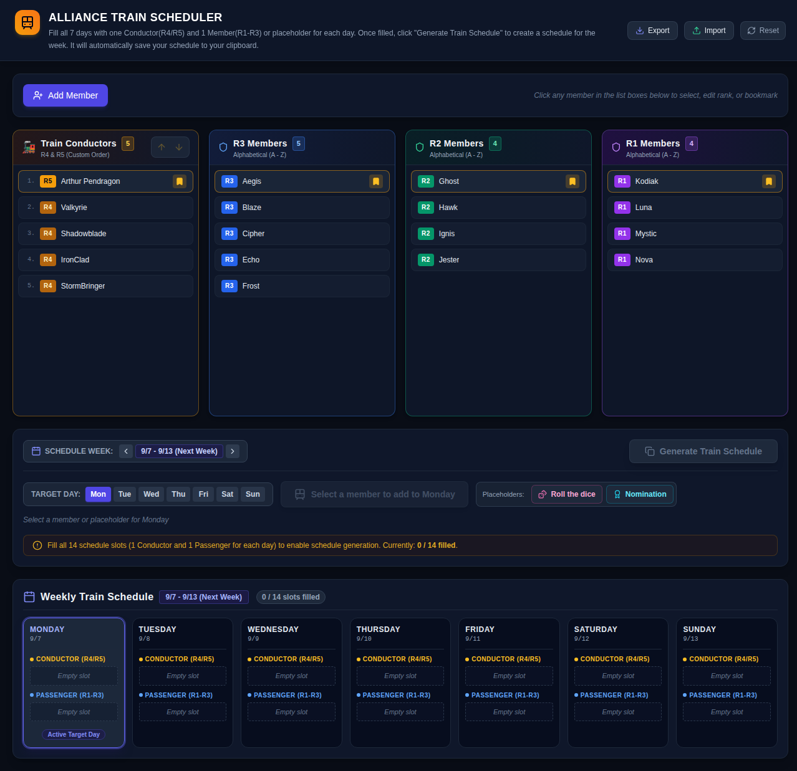

# Last War Alliance Train Scheduler

A desktop scheduler for organizing a seven-day alliance train. Assign one R4/R5 conductor and one R1-R3 member, or a placeholder, to each day and copy the finished schedule to the clipboard.

## Features

- Manage alliance members from R1 through R5
- Promote, demote, rename, and remove members
- Maintain conductor ordering for the schedule
- Assign conductors and passengers across seven days
- Use `Roll the dice` and `Nomination` passenger placeholders
- Browse independent schedules by week, with each week kept in history
- Generate a formatted weekly schedule and copy it to the clipboard
- Sync the last four weeks of train history to Google Sheets via Apps Script
- Export a CSV-style Google Sheets payload or save data to JSON
- Automatically save roster, bookmarks, and all weekly schedule history
- Export and import data as JSON
- Load a sample alliance roster for quick setup

## Screenshots

Latest screen capture of the scheduler with a populated sample roster:



## Requirements

- Node.js 18 or newer
- npm

## Development

Install dependencies:

```bash
npm install
```

Start the development app:

```bash
npm run dev
```

The development command starts the Vite-powered Electron application with hot reload for the renderer.

## Production Build

Build the TypeScript, renderer, and Electron application:

```bash
npm run build
```

The compiled renderer is written to `dist/`, and Electron build output is generated by `electron-builder` according to the local platform configuration.

To preview the renderer build without packaging Electron:

```bash
npm run preview
```

Type-check the project:

```bash
npm run lint
```

## Usage

1. Add members and assign each member an alliance level.
2. Select a member from the roster.
3. Select a target day and click the button labeled with that member, such as `Add Arthur Pendragon to Monday`.
4. For a passenger slot, use `Roll the dice` or `Nomination` when a named member is not needed.
5. Fill all seven conductor and passenger slots.
6. Choose the schedule week, then click `Generate Train Schedule` to copy the formatted schedule.
7. Open `Google Sheets` in the header to connect your Apps Script Web App and sync the last four weeks of history.

R4 and R5 members can fill conductor slots. R1, R2, and R3 members can fill passenger slots.

## Data and Backups

In the packaged Electron app, data is saved automatically to the Electron user-data directory as `train-scheduler-data.json`. In a browser-only development context, the app uses `localStorage` with the key `alliance_train_scheduler_data`.

Use `Export` in the header to create a JSON backup. Backups include every saved weekly schedule and the last-used week. Use `Import` to merge a backup into the current roster and schedule history; imported records replace schedules with matching calendar weeks, while other weeks are retained. Existing members are matched by trimmed, case-insensitive name to avoid duplicates.

Schedules are stored by the Monday date of each calendar week. The app reopens the last-used week and keeps history indefinitely. Older backups that contain only one `schedule` are migrated into the active week automatically when loaded or imported.

## Project Structure

```text
src/
  components/     React UI components
  services/       Persistence, import/export, and clipboard helpers
  types/          Shared TypeScript types and schedule utilities
electron/
  main.ts         Electron main process and file storage handlers
  preload.ts      Secure renderer-to-main process bridge
```

## Tech Stack

- React 18
- TypeScript
- Vite
- Electron
- Tailwind CSS
- Lucide React
